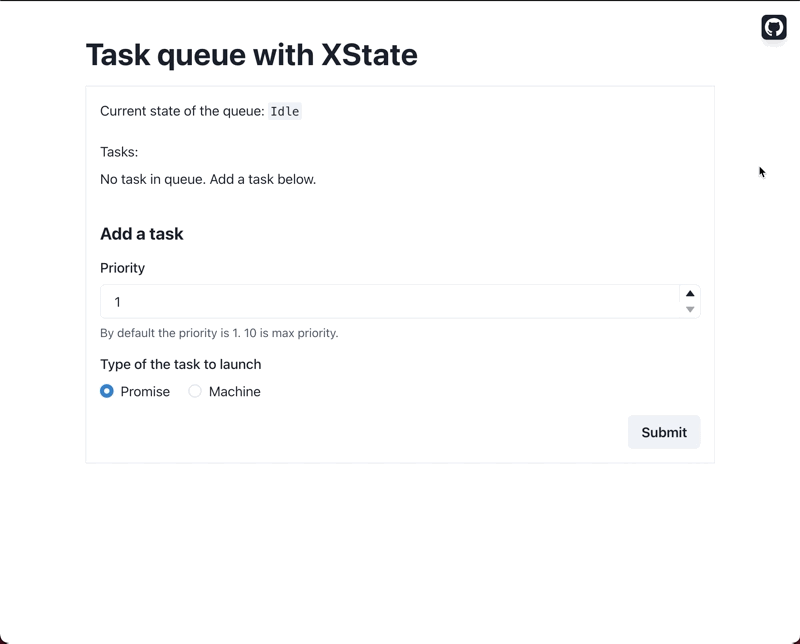

# Task Queue with XState

A task queue is a data structure containing a list of tasks to execute.

Tasks are sent to the task queue, and they are executed based on rules defined by the system. In this implementation tasks will be processed one by one, and are ordered by their *priority* and by the time they have been pending in the queue.



[Open online demo →](https://xstate-task-queue.netlify.app)

## Features

- Tasks can be added at anytime, and when a task finishes, the next one starts to be executed.
- Tasks are associated with a priority, that can be updated until they are started, and that will instantly modify the order of execution of the queue.
- Two types of tasks can be executed, to show that XState suits for simple cases (a simple promise) as well as for complex cases (a state machine with several steps).

## How does it work?


[Open task queue machine →](./machines/taskQueue.ts)

At first, the state machine is in `Idle` state and waits for a task to process.

When a task is added through `Add task to queue` event, a new task is pushed to the queue, and the queue is reordered.

If a task is made available while being in `Idle` state, an eventless transition is taken, that makes a transition to `Processing` state.

In `Processing` state, the task is executed and is marked as being executed in the context. That way, we know the state of execution of tasks.

If the execution succeeded, we mark the task as done, and go back to `Idle` state.

If the execution failed, we mark the task as failed, and go back to `Idle` state too.

When going back to `Idle` state, we transition immediately to `Processing` state if another task can be executed.

The priority of tasks can be updated at anytime, provided that they are still in the queue, and are not currently processed, nor have already been executed. This will cause the queue to be reordered.

Please note how is implemented [`Process task`](https://github.com/Devessier/xstate-task-queue/blob/6c7ca3bd78485ff808c17bebf4f9ac1cdd2995b4/machines/taskQueue.ts#L224-L236) service:

```ts
services: {
  "Process task": ({ tasks, currentTaskId }) => {
    /** ... */

    const { taskType } = tasks[currentTaskId];

    if (taskType === "Promise") {
      return taskAsPromise();
    }

    return taskMachine;
  },
},
```

XState can interpret promises and other machines as services. Once an invoked machine reaches a *final* state, its execution is stopped and the `onDone` transition is taken on the parent machine. That way, we may know when the child machine has finished processing the task.

This example is oversimplified, but [child machine may return data to its parent](https://stately.ai/docs/xstate/actors/machines#ondone-in-child-machines).
